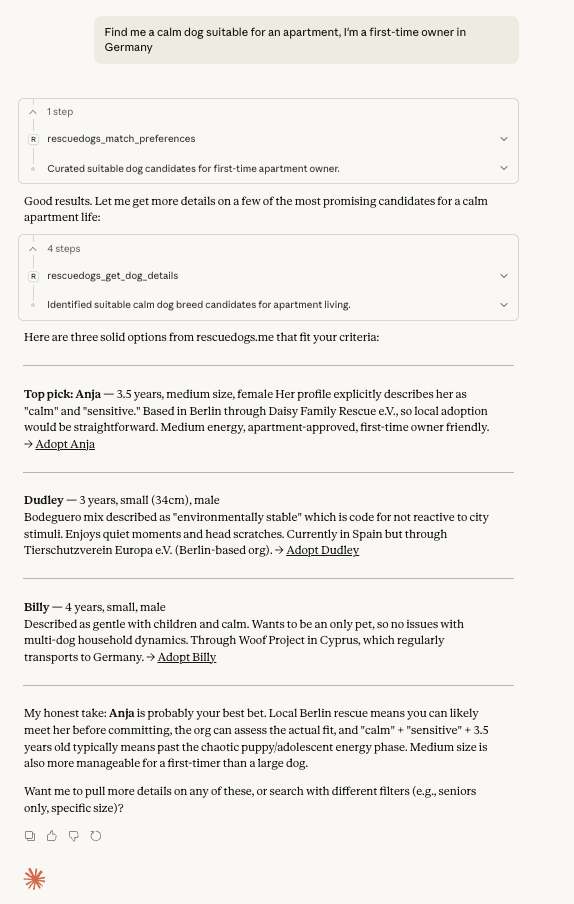
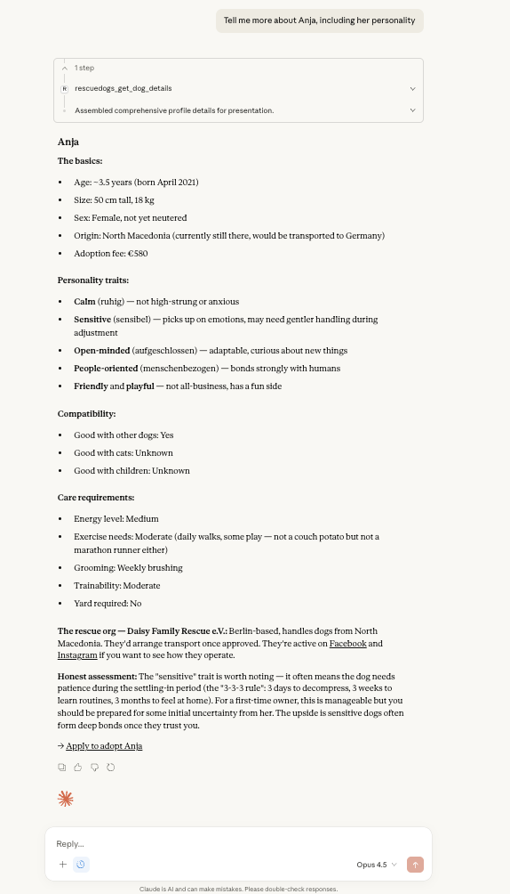

# rescuedogs-mcp-server

[](https://www.npmjs.com/package/rescuedogs-mcp-server)
[](https://opensource.org/licenses/MIT)

### Search by lifestyle


### Get detailed profiles


MCP server for discovering rescue dogs from European and UK organizations. Search, filter, and get detailed profiles of dogs available for adoption.

## Connect

### Remote (recommended)

No install. Add the endpoint as a custom connector or remote MCP server:

```
https://mcp.rescuedogs.me/mcp
```

It speaks MCP streamable HTTP, needs no authentication, and is read-only.

### Local (npm, stdio)

```bash
npm install -g rescuedogs-mcp-server
```

Then add it to your client's MCP config. For Claude Desktop that is
`~/Library/Application Support/Claude/claude_desktop_config.json` on macOS or
`%APPDATA%\Claude\claude_desktop_config.json` on Windows:

```json
{
  "mcpServers": {
    "rescuedogs": {
      "command": "npx",
      "args": ["-y", "rescuedogs-mcp-server"]
    }
  }
}
```

## Available Tools

### rescuedogs_search_dogs

Search for rescue dogs with comprehensive filtering.

```
"Find medium-sized dogs good for first-time owners"
"Show me golden retrievers available to adopt in the UK"
"Find low-energy dogs suitable for apartments"
```

**Parameters:**
- `query` - Free-text search
- `breed` - Filter by breed name
- `breed_group` - Filter by FCI group (Herding, Sporting, etc.)
- `size` - Tiny, Small, Medium, Large, XLarge
- `age_category` - puppy, young, adult, senior
- `sex` - male, female
- `energy_level` - low, medium, high, very_high
- `experience_level` - first_time_ok, some_experience, experienced_only
- `home_type` - apartment_ok, house_preferred, house_required
- `adoptable_to_country` - ISO country code (GB, IE, FR, DE)
- `organization_id` - Restrict to one rescue (see `rescuedogs_list_organizations`)
- `good_with_kids`, `good_with_dogs`, `good_with_cats` - boolean
- `limit` (1-50, default 10), `offset` - pagination
- `include_images` - Include dog photos (default: false, max 5 dogs)
- `image_preset` - `thumbnail` (200x200) or `medium` (400x400)
- `response_format` - `markdown` (default) or `json`

### rescuedogs_get_dog_details

Get full details for a specific dog including AI-generated personality profile.

```
"Tell me about the dog with slug 'buddy-12345'"
"Show me details for Max"
```

**Parameters:**
- `slug` - Dog's URL slug (required)
- `include_image` - Include photo (default: true)
- `image_preset` - `thumbnail` or `medium` (default)
- `response_format` - `markdown` (default) or `json`

### rescuedogs_list_breeds

Get available breeds with counts and statistics.

```
"What breeds are available?"
"Show me herding breeds with at least 10 dogs"
```

**Parameters:**
- `breed_group` - Filter by FCI group
- `min_count` - Minimum dogs available
- `limit` - Number of breeds to return (1-100, default 20)
- `response_format` - `markdown` (default) or `json`

### rescuedogs_get_statistics

Get overall platform statistics.

```
"How many rescue dogs are available?"
"Show me platform statistics"
```

**Parameters:**
- `response_format` - `markdown` (default) or `json`

### rescuedogs_get_filter_counts

Get available filter options with counts based on current filters.

```
"What filter options are available if I've selected Labrador breed?"
"Show me available sizes for dogs in Spain"
```

**Parameters:**
- `current_filters` - Object with any of `breed`, `size`, `age_category`, `sex`,
  `adoptable_to_country`
- `response_format` - `markdown` (default) or `json`

### rescuedogs_list_organizations

List rescue organizations with their statistics.

```
"Which rescue organizations are in the UK?"
"Show me all organizations"
```

**Parameters:**
- `country` - Filter by ISO country code
- `active_only` - Only active organizations (default: true)
- `limit` - Number to return (1-50, default 20)
- `response_format` - `markdown` (default) or `json`

### rescuedogs_match_preferences

Find dogs matching your lifestyle preferences.

```
"I live in an apartment, have moderate activity, and am a first-time dog owner"
"Find dogs for an active family with a house and garden"
```

**Parameters:**
- `living_situation` - apartment, house_small_garden, house_large_garden, rural
- `activity_level` - sedentary, moderate, active, very_active
- `experience` - first_time, some, experienced
- `has_children`, `has_other_dogs`, `has_cats` - boolean. Set to filter; omit to
  not filter on it at all
- `adoptable_to_country` - ISO country code
- `limit` - Number of matches (1-20, default 5)
- `include_images` - Include dog photos (default: false)
- `response_format` - `markdown` (default) or `json`

### rescuedogs_get_adoption_guide

Get information about the rescue dog adoption process.

```
"How does rescue dog adoption work?"
"Tell me about transport for adopting to the UK"
"What fees should I expect?"
```

**Parameters:**
- `topic` - overview, transport, fees, requirements, timeline
- `country` - ISO code for country-specific info

## Geographic Scope

Dogs are listed by European and UK rescue organizations. They are currently
located in the UK, Germany, Serbia, Bulgaria, Bosnia, Turkey and Cyprus, and
most rescues ship across the EU, EEA and UK.

US, Canadian and Australian rescues are not covered.

Use `rescuedogs_list_organizations` to see where each rescue ships, and
`rescuedogs_get_filter_counts` for the live list of destination countries -
coverage changes as organizations are added.

## Country Codes

Use these codes for the `adoptable_to_country` parameter:

| Code | Country |
|------|---------|
| GB | United Kingdom (UK also accepted) |
| IE | Ireland |
| DE | Germany |
| FR | France |
| ES | Spain |
| IT | Italy |
| NL | Netherlands |
| BE | Belgium |
| AT | Austria |
| RO | Romania |
| GR | Greece |
| BG | Bulgaria |
| CY | Cyprus |

Dogs can be adopted to countries where the rescue organization ships to. Use `rescuedogs_list_organizations` to see which countries each organization serves.

## Data Source

All data comes from [rescuedogs.me](https://www.rescuedogs.me), which aggregates
listings from independent rescue organizations. At the time of writing that is
roughly 1,400 available dogs across 96 breeds from 11 organizations; call
`rescuedogs_get_statistics` for current figures. About 99% of dogs carry an
AI-generated personality profile.

The platform is powered by the open-source
[rescue-dog-aggregator](https://github.com/ssatama/rescue-dog-aggregator)
project, which handles collection, breed standardization, AI personality
extraction, and the public API.

### How the data is gathered, and how to be removed

Listings are collected from the public adoption pages of each rescue
organization. Nothing behind a login, paywall or `robots.txt` restriction is
collected, and no personal data about adopters or staff is stored.

Every result links to the rescue's own adoption page. This project sends people
to the rescues; it does not take applications, take payment, or stand between an
adopter and an organization.

If you run one of these organizations and want your listings removed, changed,
or credited differently, open an issue on
[rescue-dog-aggregator](https://github.com/ssatama/rescue-dog-aggregator/issues)
or contact the maintainer. Removal requests are honoured, and no justification
is required.

## Transports

| Transport | Entrypoint | Used by |
|-----------|-----------|---------|
| stdio | `dist/index.js` (`npm start`) | Local clients, the npm package, Smithery |
| Streamable HTTP | `dist/http.js` (`npm run start:http`) | The remote endpoint at `/mcp` |

The HTTP transport is stateless: every request gets its own server instance, so
there are no sessions to expire and it scales horizontally without shared state.
SSE is not implemented - it is deprecated in the MCP SDK, and the current spec
revision defines only stdio and streamable HTTP.

The public endpoint is rate limited per IP, 20 requests/minute and
300 requests/hour. `/health` is exempt.

Run it locally:

```bash
npm run dev:http          # tsx, no build step
# or
npm run build && npm run start:http
```

Then point the [MCP Inspector](https://modelcontextprotocol.io/docs/tools/inspector)
at `http://localhost:3000/mcp` with transport "Streamable HTTP".

## Docker

The stdio image installs the published npm package:

```bash
docker build -t rescuedogs-mcp .
docker run -i rescuedogs-mcp
```

The remote endpoint builds from source:

```bash
docker build -f Dockerfile.http -t rescuedogs-mcp-http .
docker run -p 3000:3000 rescuedogs-mcp-http
```

## Environment Variables

| Variable | Description | Default |
|----------|-------------|---------|
| `RESCUEDOGS_API_URL` | Base URL for the rescuedogs API | `https://api.rescuedogs.me` |
| `RESCUEDOGS_IMAGE_URL` | Base URL for the image CDN | `https://images.rescuedogs.me` |
| `PORT` | Port for the HTTP transport | `3000` |
| `HOST` | Bind address for the HTTP transport | `0.0.0.0` |
| `OPENAI_APPS_CHALLENGE` | Token served at `/.well-known/openai-apps-challenge` for OpenAI domain verification | unset (route returns 404) |

## Architecture

```
src/
├── index.ts              # Entry point — stdio transport
├── http.ts               # Entry point — streamable HTTP transport
├── http-app.ts           # Express app: /mcp, /health, rate limiting
├── server.ts             # Shared MCP server factory used by both entrypoints
├── constants.ts          # Shared constants (API URLs, cache TTLs, rate limits)
├── types.ts              # TypeScript type definitions for API responses
├── schemas/
│   └── index.ts          # Zod input schemas for all tools
├── services/
│   ├── api-client.ts     # Axios-based API client with retry logic
│   ├── cache-service.ts  # In-memory cache with TTL support
│   ├── formatters.ts     # Markdown formatters for API responses
│   ├── image-service.ts  # Image fetching and CDN transform URLs
│   └── projection.ts     # Allowlisted public shapes for JSON responses
├── tools/
│   ├── index.ts          # Tool registration barrel with logging wrapper
│   ├── search-dogs.ts    # rescuedogs_search_dogs handler
│   ├── get-dog-details.ts
│   ├── list-breeds.ts
│   ├── get-statistics.ts
│   ├── get-filter-counts.ts
│   ├── list-organizations.ts
│   ├── match-preferences.ts
│   └── get-adoption-guide.ts
├── utils/
│   └── mappings.ts       # Value mappings (age, sex, country, preferences)
└── data/
    └── adoption-guides.ts # Static adoption guide content
```

## Development

```bash
# Install dependencies
npm install

# Run tests
npm test

# Run tests with coverage
npm run test:coverage

# Contract tests against the live API (excluded from `npm test`)
npm run test:contract

# Type check src
npm run typecheck

# Type check tests as well
npm run typecheck:tests

# Lint
npm run lint

# Lint with auto-fix
npm run lint:fix

# Report unused exports, files and dependencies
npm run lint:dead

# Build
npm run build

# Development mode (tsx)
npm run dev
```

CI runs `lint`, `typecheck`, `typecheck:tests`, `lint:dead`, `test` and `build` on
every pull request. `test:contract` runs on a schedule instead, so an upstream API
outage cannot block an unrelated PR.

## Contributing

See [CONTRIBUTING.md](CONTRIBUTING.md). Issues and PRs welcome!

## Privacy and Terms

- [Privacy policy](PRIVACY.md) - the short version: no personal data is
  collected, and tool inputs are search filters, not profiles.
- [Terms of use](TERMS.md)

## License

MIT
